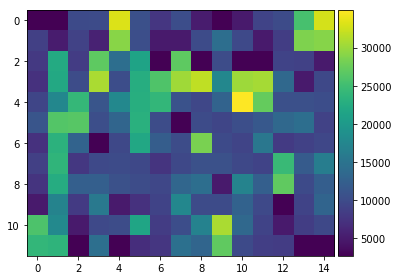
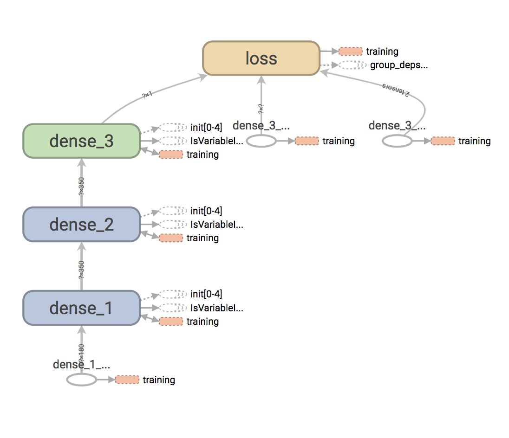
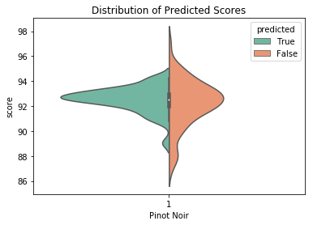
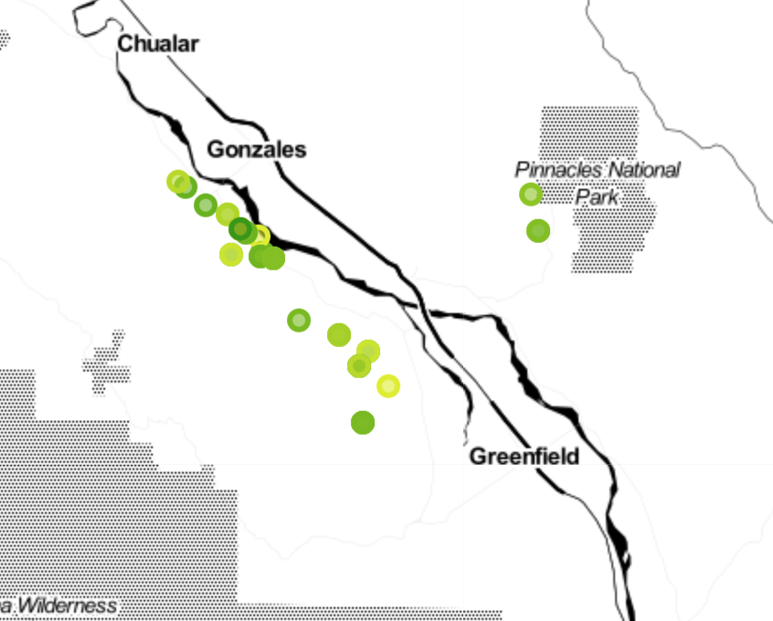

## Predicting Wine Ratings with Remote Sensing Data:
Chris Stafford

#### Goal:
***Predict wine quality using satellite images.***

Wine can vary greatly from one year to another. This is called vintage variation and it affects certain wines and growing regions more than others. Cooler climates and regions with higher variable weather tend to have greater variation between vintages. So how do you know what the ‘best vintages’ are?

###### Climate Indicators of a Bad Vintage
    Rain at the end of a growing season can lead to watery grapes with less flavor.

    Frost at the beginning of the season can kill the precious flowering buds that grow into grapes.

    A damp early season affects young vines that don’t photosynthesize properly and can cause shatter.

###### Why Satellite Images?
Nasa's landsat program is the worlds longest continuous land remote sensing.  Their newest satellite capures images on 11 spectral frequencies.

    Band 1: Deep blues and violets
    Bands 2-4: Visible blue, green, and red
    Band 5: Near infrared
    Bands 6,7: Slices of the shortwave infrared
    Band 8: Panchromatic
    Band 9: Wavelengths 1370 ± 10 nanometers
    Bands 10,11: Thermal infrared

Shortwave infrared pick up signals of wet soil and rock
Thermal infrared can tell land surface temperature
Combining other channels can distinguish soil types and other more complicated features.

#### Getting Data
Wine Enthusiast
I modified a web scraper from Zachthoutt to gather data from Wine Enthusiast. Latitude and longitude was derived from the designated vineyard location when location information could be found.  Designated vineyards are required to produce 95% of the grapes used in a wine.

Landsat 8

Landsat images were acquired from AWS for the growing season, February through October, every 16 days. I defined a vineyard to be 10 acres and took the average pixel intensity from each band and each time interval for a vineyard.

#### Scope
To start I narrowed my data down to the Western US 2014 vintages.  Looking for a wine that has a lot of variation in scores.

I chose Pinot Noir because of its large sample size and large distribution.

#### Modeling
4 tiles, 1 growing season, ~150 Pinot Noir wines

|Model|RMSE|
|---|---|
|Mean|1.986|
|Random Forest|1.446|
|2 Hidden Layer MLP (CV)| 1.643|

###### Neural network

Input
Below shows the input space for each wine.  The y-axis depicts the spectral channel and the x-axis corresponds to the time stamp, 0 being early Feb, 14 being late Sept.  The input matrix was flattened and fed into the RandomForest and MLP algorithms.

Architecture

Predictions

The above shows the distribution of predicted scores and ground truth scores.  My model has a hard time predicting extreme values.  

#### Results

-------

