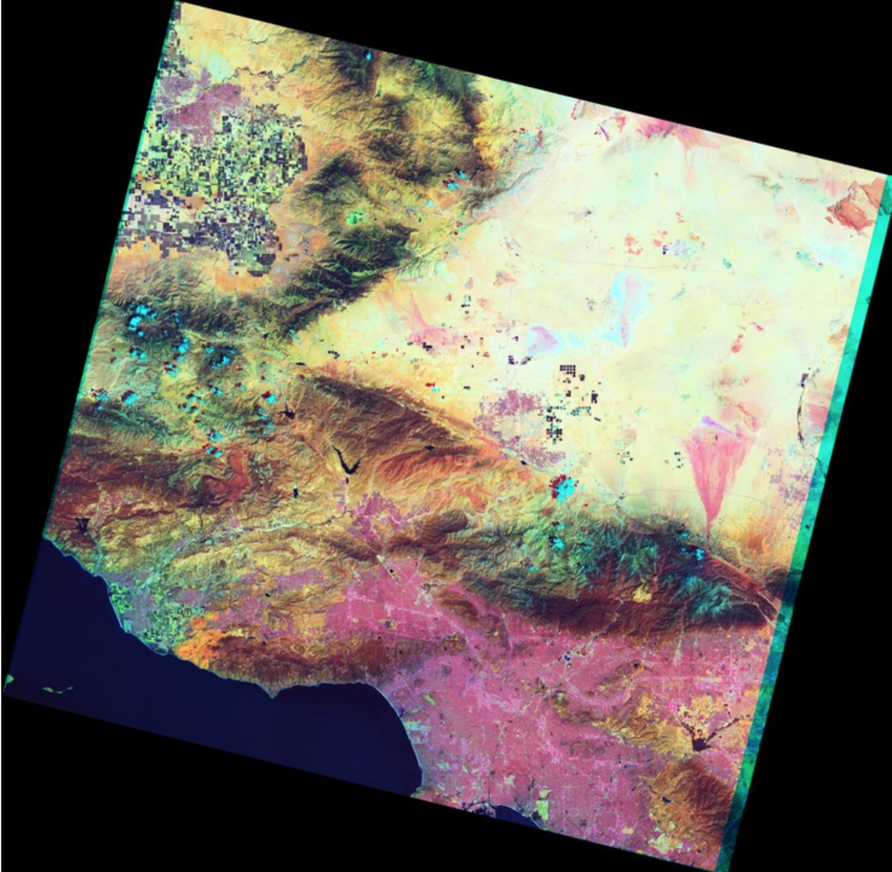
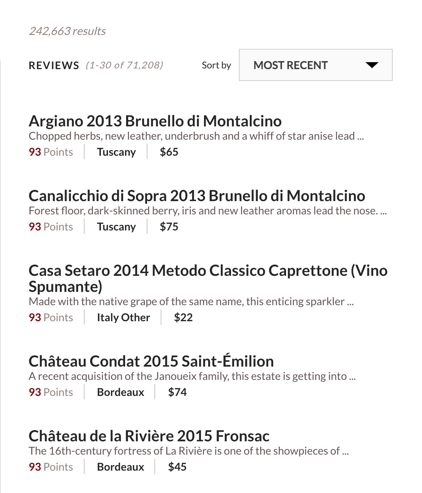
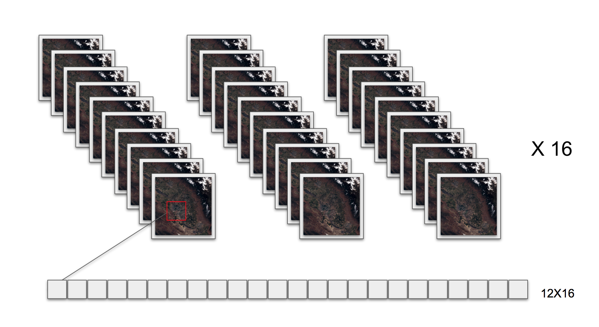
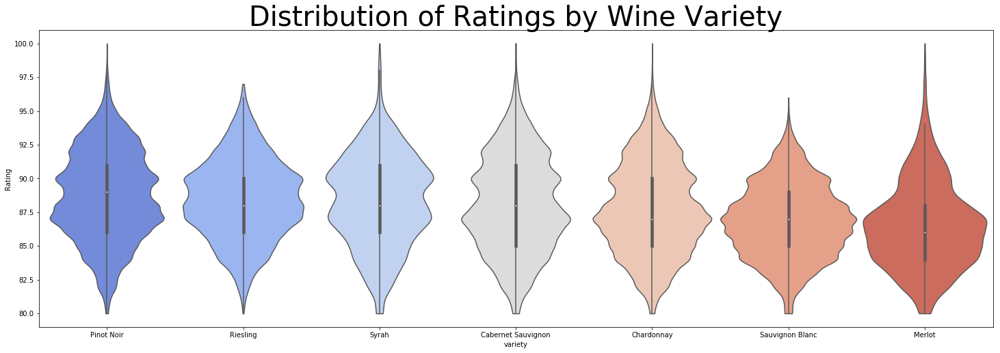
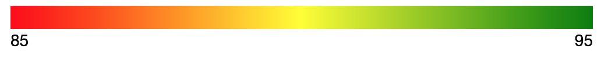
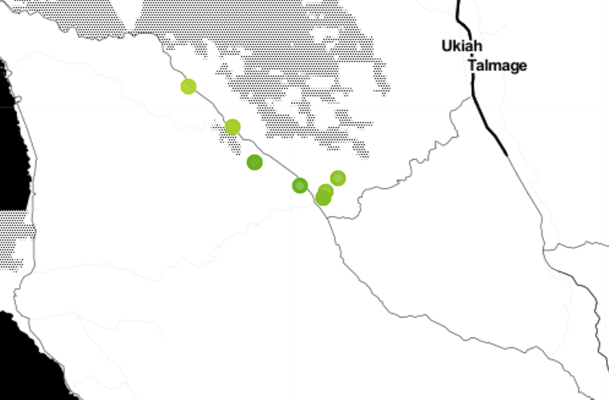

## Predicting Wine Ratings with Remote Sensing Data:
Chris Stafford

A grape from a marquee vineyard designations, and exceptional vintage are two features that distinguish superior wines. But what makes those grapes so good? Climate is the most significant factor in determining a grape’s inherent qualities. Climate can vary on small scales due to variables such as altitude, distance to bodies of water, etc. These variables can affect grape quality. Climate can also vary from year to year and affect grape quality.

#### Goal:
***Predict grape quality using satellite images.***
Create a model of grape quality that can account for the spatial and temporal variation in climate.

So how do you know what the best vineyards are?

###### Climate Indicators of a Bad Vintage
    Rain at the end of a growing season can lead to watery grapes with less flavor.

    Frost at the beginning of the season can kill the precious flowering buds that grow into grapes.

    A damp early season affects young vines that don’t photosynthesize properly and can cause shatter.

###### Why Satellite Images?
Nasa's landsat program is the worlds longest continuous land remote sensing.  Their newest satellite captures images on 11 spectral frequencies, and captures images of the entire planet every 16 days.  These images have a high spacial resolution, a single pixel being 30m x 30m.  This allows me to capture information on the growing season at the mesoclimate scale and even approach micro climate scales.  Below are a brief description of the spectral frequencies and what they try to capture.

    Band 1: Deep blues and violets
    Bands 2-4: Visible blue, green, and red
    Band 5: Near infrared
    Bands 6,7: Slices of the shortwave infrared
    Band 8: Panchromatic
    Band 9: Wavelengths 1370 ± 10 nanometers
    Bands 10,11: Thermal infrared

From this information we can deduce important features of the climate and geology.

    Shortwave infrared pick up signals of wet soil and rock
    Thermal infrared can tell land surface temperature
    Combining other channels can distinguish soil types and other more complicated features.

  

#### Getting Data
Wine Enthusiast
I modified a web scraper from Zachthoutt to gather data from Wine Enthusiast. Latitude and longitude were acquired for the designated vineyard location when location information could be found.  Designated vineyards are required to produce 95% of the grapes used in a wine. The wine score, a 20 point scale from 80-100, will be use as targets for my modeling.

Landsat 8

Landsat images were acquired by utilizing the GDAL vsis3 file handler on images from Amazon's public landsat S3 bucket. I defined a vineyard to be 10 acres and took the average pixel intensity from each band and each time interval for a vineyard for 16 time samples throughout the growing season.

#### Scope
Different wines have different factors that can distinguish an optimal growing season.  I chose to start on a single wine type.

I chose Pinot Noir because of its large sample size and large distribution.  I will continue the project only looking at Pinot Noir but the process should be able to generalize with any wine type.

#### Modeling
I chose to use RMSE as my error metric because my labels of wine scores are an imperfect estimator of grape quality:

    Great grapes are important but not the sole factor for creating a great wine.
    Wine ratings are themselves subjective.

For these reasons I should expect some inherent error in my predictions and should focus on predictions that are far away from the actual wine score.

I excluded 2 spectral bands and the quality information because initial modeling did not show them to be predictive.  After testing several models I chose to use a gradient boosting regression tree architecture to predict wine quality.

My final model uses 9 gradient boosted regression trees on individual spectral bands. An additional gradient boosted regression tree is then run on the output of individual band models.

|Model|RMSE|
|---|---|
|Mean| 2.92|
|Regional Means| 2.38|
|Gradient Boosting Regressor| 2.08|

Guessing the mean wine score has an RMSE of 2.92. Using a more sophisticated averaging technique of guessing the regional average and reduce the error to 2.38.  My model can improve the regional mean model by an additional 12%.

#### Results
Click [here](http://ec2-52-39-158-110.us-west-2.compute.amazonaws.com:8080/) to interactively explore predicted Pinot Noir vineyard quality for 2017. Individual dots show the predicted value and fall on the scale below.

